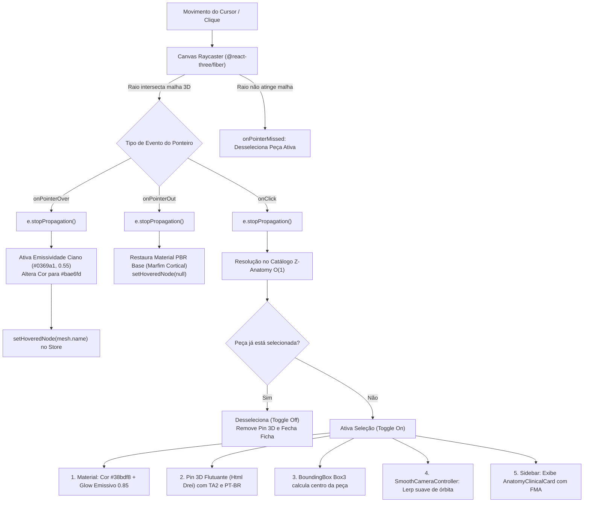

# 🧬 Atlas 3D de Anatomia Médica (Z-Anatomy & BodyParts3D)

[](https://www.typescriptlang.org/)
[](https://react.dev/)
[](https://threejs.org/)
[](https://vitejs.dev/)
[-brightgreen.svg)](https://vitest.dev/)
[](https://cloud.google.com/run)
[](https://creativecommons.org/licenses/by-sa/4.0/)

Plataforma médica e educacional em 3D de alta fidelidade para estudo e dissecação virtual do **corpo humano completo**, baseada nas malhas escaneadas em alta resolução do projeto aberto **Z-Anatomy** e **BodyParts3D / DBCLS**, com **Exploded View** (visão explodida desarticulando peças reais no espaço 3D), **Dissecção Tomográfica Multiplanar (MPR)**, seleção interativa com mouse via raycasting GPU, e navegação taxonômica pela **Terminologia Anatomica internacional (TA2)**.

Consulte também o documento canônico de design e tokens visuais em [`designer.md`](designer.md).

---

## 🌟 Funcionalidades Principais

### 1. Esqueleto Humano Completo (335 Ossos Reais Desarticulados)
- **Crânio e Viscerocrânio**: 40 ossos individuais (Frontal, Parietais D/E, Occipital, Temporais, Esfenoide, Etmoide, Mandíbula, Maxilas, Zigomáticos, Nasais, Lacrimais, Palatinos e Vômer).
- **Coluna Vertebral**: C1 (Atlas) a C7 (Proeminente), T1 a T12, L1 a L5, Osso Sacro e Cóccix.
- **Caixa Torácica**: Esterno completo (Manúbrio, Corpo e Processo Xifoide), Costelas 1 a 12 bilaterais e cartilagens costais.
- **Cíngulo e Membros Superiores**: Clavículas, Escápulas, Úmeros, Rádios, Ulnas, Ossos do Carpo, Metacarpos e Falanges.
- **Cíngulo Pélvico e Membros Inferiores**: Ílios, Ísquios, Púbis, Fêmures, Patelas, Tíbias, Fíbulas, Tarsos, Metatarsos e Falanges.

### 2. Filtragem e Isolamento por Regiões Anatômicas com Zoom Adaptativo
- **Crânio & Face**: Isola os 40 ossos cranianos e centraliza o crânio no meio do viewport com zoom cirúrgico na altura dos olhos.
- **Coluna Vertebral**: Foco nas vértebras cervicais, torácicas, lombares e sacro com descompactação axial.
- **Caixa Torácica**: Foco nas costelas e esterno com abertura em leque.
- **Membros Superiores**: Ombro, braço, antebraço e mão.
- **Pelve & Quadril**: Cintura pélvica e sacro.
- **Membros Inferiores**: Fêmur, joelho, perna e pé.
- **Todo o Esqueleto**: Arcabouço corporal completo de 2 metros articulado.

### 3. Motor Desacoplado de Exploded View com Âncora Axial Estática (`src/core/explodedEngine.ts`)
- **Desarticulação Vetorial em Nós Planos**: Desacoplamento estrito entre o grafo de cena Three.js e a taxonomia da UI, garantindo 60 FPS contínuos via `applyExplodedStep` com interpolação linear (`MathUtils.lerp`).
- **Regra de Ouro da Bússola Axial**: A coluna vertebral e a pelve são travadas como **âncoras imóveis** (`isAnchor: true`, deslocamento 0.0) na visão de corpo inteiro, preservando a referência espacial anatômica. No crânio isolado, o osso esfenoide e occipital funcionam como âncora basal central para a dispersão da calvária e face.

### 4. Máquina de Estados de 6 Camadas Cirúrgicas (`src/core/visibilityManager.ts`)
- Simulação de dissecação por planos fasciais e cirúrgicos reais (níveis 1 a 6):
  - **Camada 01**: *Tegumento Comum* (Pele e Tecido Subcutâneo)
  - **Camada 02**: *Muscular Superficial* (Deltoide, Peitoral Maior, Trapézio, Grande Dorsal, Reto Femoral)
  - **Camada 03**: *Muscular Profundo* (Manguito Rotador, Intercostais, Eretores da Espinha, Psoas)
  - **Camada 04**: *Esqueleto Axial & Apendicular* (Arcabouço ósseo de sustentação)
  - **Camada 05**: *Vascular & Nervoso* (Grandes vasos, plexos nervosos e medula espinhal)
  - **Camada 06**: *Vísceras & Cavidades* (Coração, pulmões, TGI, rins e encéfalo)
- **Blindagem Ativa de Raycasting na GPU**: Malhas ocultas ou em *Ghosting* (10% de opacidade no modo Solo) têm o método `mesh.raycast = () => {}` anulado, eliminando 100% de cliques falsos ou interceptações fantasma.

### 5. Sistemas Viscerais e Musculares Reais Co-localizados
- **Sistema Muscular** (`muscular_male.glb`): 1.388 músculos legítimos sobrepostos ao esqueleto.
- **Sistema Respiratório** (`respiratory_male.glb`): Traqueia, brônquios e pulmões com lobos no tórax.
- **Sistema Cardiovascular** (`cardiovascular_male.glb`): Coração e árvore arterial/venosa no mediastino.
- **Sistema Digestório** (`digestive_male.glb`): Esôfago, estômago, fígado, pâncreas e intestinos.
- **Sistema Nervoso** (`nervous_male.glb`): Encéfalo com hemisférios, cerebelo e medula espinhal.
- **Sistema Urinário** (`renal_male.glb`): Rins bilaterais e vias urinárias no retroperitônio.
- **Sistemas Linfático, Articular, Endócrino e Reprodutor**: Vasos, linfonodos, cápsulas articulares e glândulas.

### 6. Dissecção Tomográfica Multiplanar (MPR)
- Ferramenta cirúrgica flutuante para fatiar o corpo humano em tempo real nos três planos ortogonais fundamentais:
  - **Sagital** (Plano Mediano D/E)
  - **Coronal** (Plano Frontal Anterior/Posterior)
  - **Axial** (Plano Transversal Superior/Inferior)
- Modos visuais: **Sólido PBR**, **Raio-X (X-Ray translúcido)** e **Corte Tomográfico**.

### 6. Catálogo Taxonômico Canônico e Pins 3D
- 1.584 itens mapeados em [`zAnatomyCatalog.ts`](src/shared/constants/zAnatomyCatalog.ts) com lookups $O(1)$ (`Z_ANATOMY_BY_ID` e `Z_ANATOMY_BY_NODE`).
- Etiquetas 3D flutuantes com Terminologia Anatomica oficial (TA2 em latim) e nomes em Português do Brasil.
- Ficha Clínica na barra lateral com origem, inserção e importância cirúrgica/semiológica.

---

## 🧭 Mecânica da Área do Mouse & Seleção Tridimensional

A interação do mouse com o modelo 3D é gerenciada pelo motor de renderização Three.js (`@react-three/fiber`), combinando testes de interseção vetorial (*raycasting*), controle orbital e realce dinâmico de materiais PBR em tempo real.



### Detalhamento da Mecânica do Ponteiro

1. **Hover Detection (`onPointerOver` / `onPointerOut`)**:
   - Quando o ponteiro do mouse sobrevoa qualquer uma das 335 peças ósseas ou estruturas viscerais, o evento dispara `onPointerOver`.
   - `e.stopPropagation()` impede que o raio atravesse e destaque peças anatômicas profundas oclusas.
   - O material da peça adquire realce imediato (`baseMaterial.color.set('#bae6fd')`, `emissive.set('#0369a1')`, `emissiveIntensity = 0.55`), fornecendo feedback tátil e visual de que a peça é interativa.
   - Ao mover o cursor para fora da peça, `onPointerOut` restaura os parâmetros do material de marfim cortical.

2. **Seleção Direta por Clique (`onClick`)**:
   - O clique com o botão primário do mouse intercepta a malha através do raycaster da GPU.
   - O identificador `e.object.name` é resolvido de forma determinística em tempo constante $O(1)$ através de `Z_ANATOMY_BY_NODE` ou pela sanitização `sanitizeNodeName(mesh.name)`.
   - **Feedback Visual da Seleção**:
     - O material adquire coloração ciano cirúrgico `#38bdf8` com emissão intensa `#0284c7` (intensidade `0.85`) e opacidade `1.0`.
     - Um **Pin 3D Flutuante** (`@react-three/drei` `Html`) ancora-se a `+0.06` acima do centróide da peça com escala proporcional à distância (`distanceFactor={4.5}`), exibindo o nome em Português e a nomenclatura oficial em Latim TA2.
   - **Centralização Automática de Câmera**:
     - Uma caixa delimitadora tridimensional (`THREE.Box3().setFromObject(mesh)`) calcula o centro geométrico exato da estrutura.
     - O alvo de foco é enviado ao `useAnatomyStore.setCameraFocusTarget([x, y, z])`.
     - O componente `SmoothCameraController` interpola esfericamente o centro focal do `OrbitControls` a uma taxa de `0.08` por quadro até convergir com tolerância $\le 0.0001$, cessando o consumo de ciclos de GPU.
   - **Sincronização com o Painel Esquerdo**:
     - O componente `AnatomyClinicalCard` é renderizado instantaneamente no topo da sidebar esquerda, apresentando identificadores canônicos FMA, atalhos de ação cirúrgica e notas clínicas.

3. **Desseleção no Vazio (`onPointerMissed`)**:
   - Clicar com o mouse em qualquer área vazia do viewport 3D fora dos modelos anatômicos aciona o listener `onPointerMissed={() => onSelectNode(null)}` do Canvas.
   - Isso limpa a seleção ativa, remove o Pin 3D, fecha o dossiê clínico e devolve a câmera ao modo de visualização geral.

4. **Navegação de Câmera e Órbita com o Mouse (`OrbitControls`)**:
   - **Botão Esquerdo + Arrastar**: Rotação orbital esférica 360 graus ao redor do ponto anatômico focal.
   - **Botão Direito + Arrastar**: Panorâmica linear (*Pan*) nos eixos transversais da tela.
   - **Roda do Mouse (*Scroll*)**: Zoom contínuo in/out mantendo o vetor de aproximação.
   - **Interação com o ViewCube (`OrientationGizmo`)**: Clique com o mouse em qualquer uma das faces do cubo (Anterior, Posterior, Superior, Inferior, Lateral D/E) reposiciona a câmera instantaneamente para a projeção anatômica correspondente.

---

## ⚡ Grafo dos Nós de Ativação e Arquitetura de Funções

O ecossistema adota uma arquitetura reativa unificada baseada em Zustand (`useAnatomyStore.ts`) como **Única Fonte da Verdade** (*Single Source of Truth*), garantindo que modificações disparadas pelo mouse no 3D, pela árvore taxonômica, por atalhos de teclado ou por filtros reflitam instantaneamente em toda a aplicação.

```mermaid
graph TD
    subgraph ENTRADAS["NÓS DE ENTRADA E CONTROLE"]
        IN_MOUSE["Mouse 3D (Raycaster / Click / Hover)"]
        IN_KEYS["Atalhos Clínicos de Teclado (H, I, F, Z, Esc, R)"]
        IN_FILTERS["Filtros Rápidos (11 Sistemas e 7 Regiões)"]
        IN_TREE["Árvore Taxonômica (Checkboxes Tri-State & Busca)"]
        IN_MPR["Dock de Dissecção MPR (Planos & Sliders mm)"]
        IN_NAV["Top Navigation Bar (Densidade 100%/35%/0% & Zen)"]
        IN_PRESETS["Presets Canônicos (Crânio, Coluna, Tórax, etc.)"]
    end

    subgraph STORE["HUB CENTRAL REATIVO (useAnatomyStore)"]
        ST_SEL["selectedNodeId / hoveredNodeId"]
        ST_VIS["hiddenNodeIds (Set imutável)"]
        ST_SYS["activeSystem / activeRegion"]
        ST_EXP["explosionProgress (0.0 a 1.0)"]
        ST_DIS["dissection (activePlane, offset, mode)"]
        ST_CAM["cameraFocusTarget / cameraPositionTarget"]
        ST_ZEN["zenMode / outlinerCollapsed"]
    end

    subgraph ATORES["NÓS DE EFEITO E RENDERIZAÇÃO"]
        OUT_GLB["RealBodyAtlas (GLBs Reais & Materiais PBR)"]
        OUT_CAM["SmoothCameraController (Lerp OrbitControls)"]
        OUT_SHADERS["DissectionController (WebGL ClippingPlanes)"]
        OUT_CARD["AnatomyClinicalCard (Ficha Médica & FMA)"]
        OUT_TREE_UI["TreeGroup / TreeItem (Sync Tri-State)"]
        OUT_HUD["TelemetryOverlay (FPS, Triângulos, DrawCalls)"]
    end

    IN_MOUSE -->|onClick / onPointerOver| ST_SEL
    IN_MOUSE -->|Box3 Center| ST_CAM
    IN_KEYS -->|H / I / R| ST_VIS
    IN_KEYS -->|F| ST_CAM
    IN_KEYS -->|Z| ST_ZEN
    IN_KEYS -->|Esc| ST_SEL
    IN_FILTERS -->|setActiveSystem / setActiveRegion| ST_SYS
    IN_TREE -->|toggleVisibility / toggleGroup| ST_VIS
    IN_TREE -->|onSelectNode| ST_SEL
    IN_MPR -->|setDissection / offset| ST_DIS
    IN_NAV -->|setSolidOpacity / setViewType| STORE
    IN_PRESETS -->|applyPreset| STORE

    ST_SEL --> OUT_GLB
    ST_SEL --> OUT_CARD
    ST_SEL --> OUT_TREE_UI
    ST_VIS --> OUT_GLB
    ST_VIS --> OUT_TREE_UI
    ST_SYS --> OUT_GLB
    ST_EXP --> OUT_GLB
    ST_DIS --> OUT_SHADERS
    ST_CAM --> OUT_CAM
    ST_ZEN --> OUT_TREE_UI
```



### Principais Fluxos de Ativação

| Fluxo Funcional | Gatilhos de Entrada | Mutação no Store | Efeito Tridimensional / Visual |
| :--- | :--- | :--- | :--- |
| **Foco & Seleção** | Clique do mouse no 3D, clique na árvore, tecla `F` | `setSelectedNode(id)`, `setCameraFocusTarget([x,y,z])` | Malha adquire brilho ciano, Pin 3D flutuante surge, câmera centraliza via lerp e card clínico abre. |
| **Visibilidade Tri-State** | Checkbox da árvore, tecla `H` (Ocultar), tecla `I` (Isolar) | `toggleVisibility(id)`, `isolateNode(id, allIds)` | Atualiza `hiddenNodeIds`; `mesh.visible` atualiza em tempo real; ícones de checkbox refletem estado. |
| **Filtro de Região & Zoom**| Seletor de regiões (Crânio, Coluna, etc.) ou Presets 1-7 | `setActiveRegion(reg)`, `cameraFocusTarget` | `RealBodyAtlas` recalcula escala (ex: Crânio escala $3.1\times$ com zoom na altura dos olhos) e filtra ossos. |
| **Exploded View em GPU** | Slider de explosão na toolbar | `setExplosionProgress(val)` | O loop `useFrame` translada cada uma das 335 peças pelo seu vetor biomecânico de explosão via lerp. |
| **Dissecção MPR** | Botões Sagital/Coronal/Axial e sliders de corte em mm | `setDissection(updater)` | `DissectionController` atualiza os planos de clipagem nativos do WebGL sem regenerar geometrias na VRAM. |
| **Foco Cirúrgico (Zen Mode)**| Tecla `Z` ou botão na barra superior | `toggleZenMode()` | Colapsa a barra lateral esquerda, expandindo o viewport 3D para 100% da largura da tela. |

---

## 🏗️ Arquitetura do Sistema Fullstack

```text
┌────────────────────────────────────────────────────────────────────────┐
│                          APLICAÇÃO FULLSTACK                           │
├────────────────────────────────────────────────────────────────────────┤
│  FRONTEND (React 19 + Three.js + React Three Fiber + Drei + Zustand)  │
│  ├── Canvas 3D (WebGLRenderer + Draco Loader Local Offline)            │
│  │   ├── RealBodyAtlas.tsx (335 ossos, vísceras, músculos e exploded)  │
│  │   ├── SceneCanvas.tsx (Câmera, iluminação, raycaster e telemetria) │
│  │   ├── SmoothCameraController.tsx (Interpolação de foco de órbita)  │
│  │   └── DissectionController.tsx (Shaders e clipping planes MPR)      │
│  ├── Interface Unificada à Esquerda (AnatomyTreePanel.tsx - 360px)     │
│  │   ├── AnatomyClinicalCard.tsx (Dossiê clínico, FMA e ações rápidas) │
│  │   ├── AnatomyFiltersSection.tsx (11 sistemas e 7 regiões do corpo)  │
│  │   └── TreeGroup.tsx / TreeItem.tsx (Árvore com checkboxes tri-state)│
│  └── HUDs Flutuantes no Viewport 100% Livre                            │
│      ├── DissectionToolbar.tsx (Controles de fatiamento tomográfico)  │
│      ├── OrientationGizmo.tsx (ViewCube de projeções ortogonais)       │
│      ├── QuickPresetsBar.tsx (Atalhos anatômicos rápidos)              │
│      └── TelemetryOverlay.tsx (Monitor em tempo real de FPS e VRAM)    │
├────────────────────────────────────────────────────────────────────────┤
│  BACKEND (Node.js + Express + TypeScript)                              │
│  ├── Healthcheck Sondas (/api/health e /healthz)                       │
│  ├── Rewrites e Proxy via Firebase Hosting CDN                         │
│  └── Container Docker Multi-stage para Google Cloud Run (us-central1)  │
└────────────────────────────────────────────────────────────────────────┘
```

---

## 📁 Estrutura de Diretórios

```text
app-anatomy/
├── designer.md                          # Guia oficial de Design System e UI/UX médica
├── public/
│   ├── draco/gltf/                      # Decodificador Draco WASM offline de alto desempenho
│   └── models/
│       └── anatomy/                     # Malhas médicas autênticas Z-Anatomy / BodyParts3D
│           ├── skeletal_male.glb        # 335 ossos reais desarticulados
│           ├── muscular_male.glb        # 1.388 músculos reais
│           ├── respiratory_male.glb     # Traqueia e pulmões
│           ├── cardiovascular_male.glb  # Coração e rede vascular
│           ├── digestive_male.glb       # Trato gastrointestinal e glândulas
│           ├── nervous_male.glb         # Encéfalo e medula espinhal
│           ├── renal_male.glb           # Rins e vias urinárias
│           ├── articular_male.glb       # Ligamentos e cápsulas articulares
│           ├── lymphatic_male.glb       # Linfonodos e vasos linfáticos
│           ├── endocrine_male.glb       # Glândulas endócrinas
│           └── reproductive_male.glb    # Órgãos reprodutores
├── src/
│   ├── core/                            # Motor WebGL puro desacoplado (Zero React DOM)
│   │   ├── explodedEngine.ts            # LERP amortecido, âncoras axiais fixas e vetores
│   │   └── visibilityManager.ts         # Máquina das 6 camadas cirúrgicas e blindagem de raycast
│   ├── client/
│   │   ├── components/
│   │   │   ├── canvas/
│   │   │   │   ├── RealBodyAtlas.tsx    # Motor 3D do corpo real: filtros e exploded view
│   │   │   │   ├── AnatomicalAtlasScene.tsx # Isolador de cena e fallback didático
│   │   │   │   ├── SceneCanvas.tsx      # Viewport WebGL Three.js, iluminação e câmera
│   │   │   │   ├── SmoothCameraController.tsx # Lerp de foco de câmera no centróide
│   │   │   │   ├── DissectionController.tsx # Shaders e planos de corte tomográfico MPR
│   │   │   │   └── OrientationGizmo.tsx # Cubo de orientação 3D (ViewCube)
│   │   │   ├── telemetry/
│   │   │   │   └── TelemetryOverlay.tsx # Monitor de performance da GPU
│   │   │   └── ui/
│   │   │       ├── DissectionToolbar.tsx# Barra clínica de dissecção MPR
│   │   │       ├── QuickPresetsBar.tsx  # Presets rápidos de enquadramento
│   │   │       └── tree/
│   │   │           ├── AnatomyTreePanel.tsx     # Painel unificado da barra esquerda
│   │   │           ├── AnatomyClinicalCard.tsx  # Ficha anatômica integrada no topo
│   │   │           ├── AnatomyFiltersSection.tsx# Filtros rápidos de sistemas e regiões
│   │   │           ├── ModuleLayersSection.tsx  # Slider de 6 planos de dissecação cirúrgica
│   │   │           ├── TreeGroup.tsx            # Grupos da árvore com tri-state
│   │   │           └── TreeItem.tsx             # Itens atômicos da árvore taxonômica
│   │   ├── hooks/
│   │   │   └── useAnatomicalHotkeys.ts  # Gerenciador global de atalhos de teclado
│   │   ├── stores/
│   │   │   └── useAnatomyStore.ts       # Store reativo central Zustand (activeDepth 1-6)
│   │   ├── App.tsx                      # Orquestrador global e estados da aplicação
│   │   └── index.css                    # Design system médico executivo e responsivo
│   ├── server/                          # Backend Express e sondas de saúde
│   └── shared/
│       ├── constants/
│       │   ├── zAnatomyCatalog.ts       # 1.584 itens com nomes em PT-BR, TA2 e lookups O(1)
│       │   └── cranium.ts               # Constantes canônicas cranianas
│       └── types/
│           ├── anatomy.ts               # Contratos tipados: AnatomicalMeshUserData e nós
│           ├── taxonomicTree.ts         # Contratos de tri-state e árvore taxonômica
│           └── dissection.ts            # Tipos de dissecção MPR e planos de corte
├── scripts/
│   └── build_z_anatomy_catalog.py       # Pipeline gerador do catálogo tipado TypeScript
└── tests/
    ├── exploded-engine-and-layers.test.ts # Testes de âncoras axiais, 6 camadas e raycast
    ├── unified-outliner-layout.test.ts  # Testes de layout unificado e zero emojis
    ├── pre-delivery-validation.test.ts  # Quality gates de pré-entrega
    └── *.test.ts                        # 145 testes unitários aprovados em 24 suítes Vitest
```

---

## ⌨️ Mapa Canônico de Atalhos de Teclado

| Tecla de Atalho | Ação Executada | Escopo |
| :--- | :--- | :--- |
| `Z` | Alterna Modo Foco Cirúrgico (*Zen Mode*: 100% de tela limpa para o 3D) | Global |
| `F` | Foca e centraliza suavemente a câmera na peça anatômica selecionada | Peça Selecionada |
| `I` | Isola a peça selecionada, ocultando todas as demais estruturas | Peça Selecionada |
| `H` | Alterna a visibilidade (*Hide/Show*) da estrutura selecionada | Peça Selecionada |
| `Esc` ou `X` | Desseleciona a peça ativa e fecha o dossiê clínico | Global |
| `R` | Reseta a câmera, rotação, zoom e planos de dissecção para o padrão | Global |
| `1` a `7` | Aciona diretamente os presets regionais (Crânio, Coluna, Tórax, etc.) | Global |

---

## 🚀 Como Executar Localmente

### 1. Pré-requisitos
- Node.js 20+ (recomendado Node.js 22 LTS)
- PowerShell 7 (`pwsh`) no Windows ou Bash no Linux/macOS

### 2. Instalação de Dependências
```powershell
npm install
```

### 3. Modo de Desenvolvimento (Hot-Reload)
Inicia o backend Express na porta `8080` e o frontend Vite na porta `3000`:
```powershell
npm run dev
```

Acesse no navegador:
- **Atlas 3D Interativo**: `http://localhost:3000`
- **Healthcheck da API**: `http://localhost:8080/api/health`

### 4. Execução de Testes e Checagem Estrita de Tipos
```powershell
# Checagem rigorosa de tipos TypeScript (Cliente + Servidor)
npm run typecheck

# Execução da suíte completa de testes unitários (145 testes em 24 suítes)
npm test
```

### 5. Compilação de Produção
```powershell
npm run build
npm start
```

---

## ☁️ Deploy no Google Cloud Run

O projeto possui container Docker multi-stage otimizado para a porta dinâmica `$PORT` do Cloud Run e script automatizado de validação pré-voo:

```powershell
# Execução automatizada com Quality Gate (Typecheck + 145 testes + Build + Deploy)
powershell -ExecutionPolicy Bypass -File .\deploy-cloudrun.ps1
```

- **Ambiente de Produção Ativo**: [https://appmy-1044179901556.us-central1.run.app](https://appmy-1044179901556.us-central1.run.app)
- **Healthcheck Live**: [https://appmy-1044179901556.us-central1.run.app/api/health](https://appmy-1044179901556.us-central1.run.app/api/health)
- **Revisão Ativa**: `appmy-00004-hxb` (`us-central1` / `agent-md-506215`)

---

## 📄 Licença e Créditos

- **Código da Aplicação**: MIT License.
- **Malhas Anatômicas 3D**: Derivadas do projeto [Z-Anatomy](https://www.z-anatomy.com/) sob licença **Creative Commons Attribution-ShareAlike 4.0 International (CC BY-SA 4.0)**, originadas do [BodyParts3D](http://lifesciencedb.jp/bp3d/) / DBCLS (CC BY-SA 2.1 JP). Consulte os arquivos `public/models/anatomy/LICENSE` e `NOTICE`.