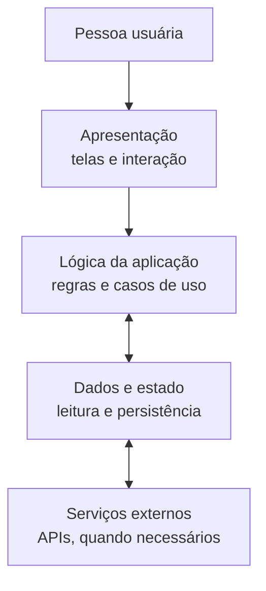

# appmy

## Anatomia do aplicativo

O repositório ainda não contém uma implementação. O diagrama abaixo é uma
visão conceitual proposta para orientar a estrutura do aplicativo, não uma
descrição de componentes já existentes.

### Descrição das partes

- **Apresentação:** exibe as telas e encaminha as ações da pessoa usuária.
- **Lógica da aplicação:** coordena as ações e aplica as regras do produto,
  sem depender diretamente de detalhes visuais.
- **Dados e estado:** mantém os dados usados pela aplicação e define como são
  lidos ou persistidos.
- **Serviços externos:** integrações opcionais, acessadas pela camada de dados
  quando o produto precisar delas.

O fluxo principal parte da pessoa usuária, passa pela apresentação e pela
lógica da aplicação e, quando necessário, consulta ou atualiza os dados. As
integrações externas são opcionais; nenhuma tecnologia ou serviço específico
foi escolhido ainda.